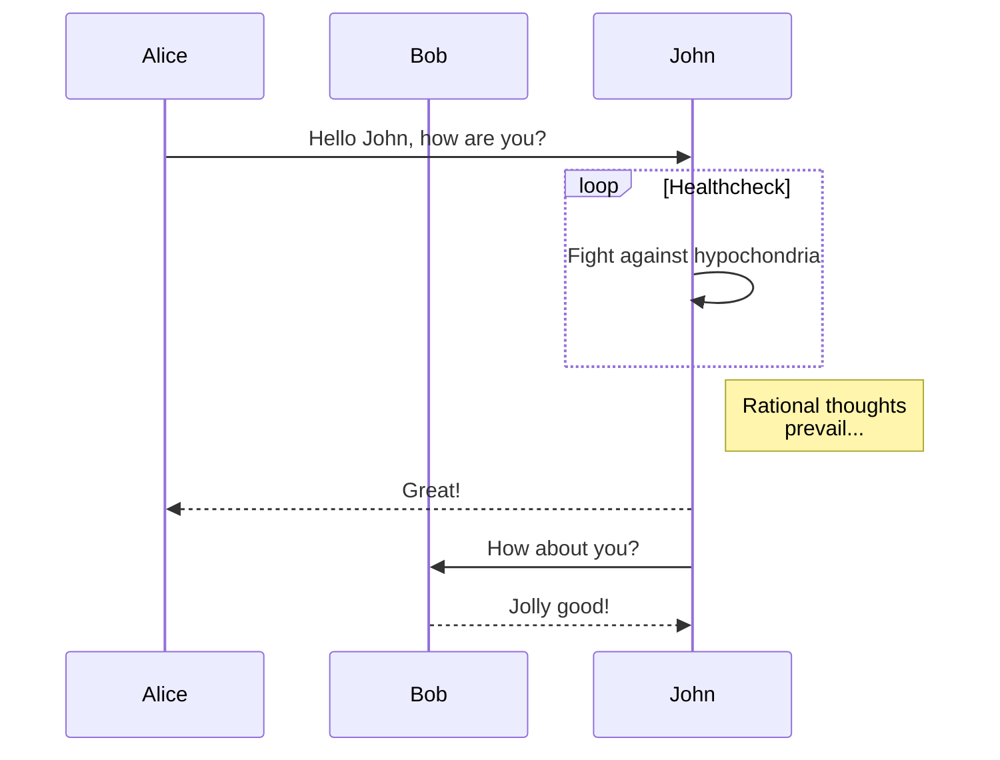
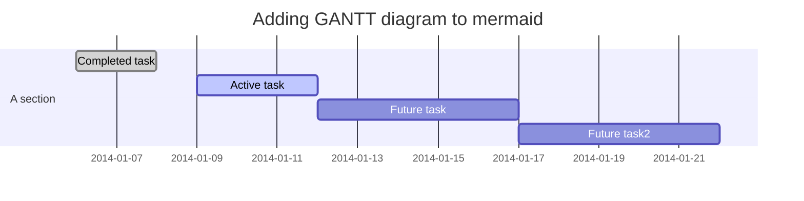
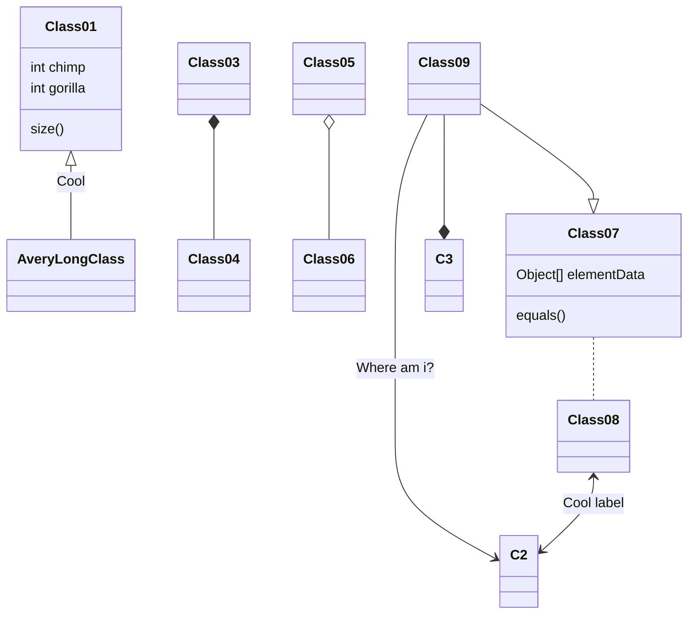

2019-06-02-hello-world
<!-- more -->

Welcome to [Hexo](https://hexo.io/)! This is your very first post. Check [documentation](https://hexo.io/docs/) for more info. If you get any problems when using Hexo, you can find the answer in [troubleshooting](https://hexo.io/docs/troubleshooting.html) or you can ask me on [GitHub](https://github.com/hexojs/hexo/issues).

## Quick Start

### Create a new post

``` bash
$ hexo new "My New Post"
```

More info: [Writing](https://hexo.io/docs/writing.html)

### Run server

``` bash
$ hexo server
```

More info: [Server](https://hexo.io/docs/server.html)

### Generate static files

``` bash
$ hexo generate
```

More info: [Generating](https://hexo.io/docs/generating.html)

### Deploy to remote sites

``` bash
$ hexo deploy
```

More info: [Deployment](https://hexo.io/docs/one-command-deployment.html)

### 数学公式 LaTex

基于 MathJax 引擎：

$$
6 \mathrm { CO } _ { 2 } + 6 \mathrm { H } _ { 2 } \mathrm { O } \rightarrow \mathrm { C } _ { 6 } \mathrm { H } _ { 12 } \mathrm { O } _ { 6 } + 6 \mathrm { O } _ { 2 }
$$

$$
\Gamma _ { \epsilon } ( x ) = [ 1- e ^ { - 2\pi \epsilon } ] ^ { 1- x } \prod _ { n = 0} ^ { \infty } \frac { 1- \operatorname{exp} ( - 2\pi \epsilon ( n + 1) ) } { 1- \operatorname{exp} ( - 2\pi \epsilon ( x + n ) ) }
$$

### 流程图

基于 mermaid 语法：







### 参考
[^1]: 参考资料1
[^2]: 参考资料2